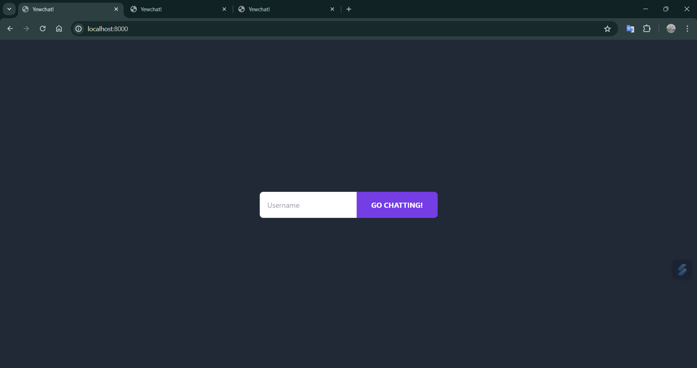
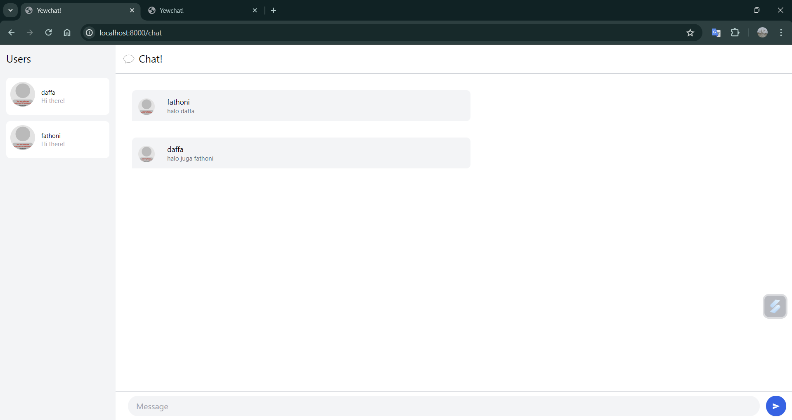
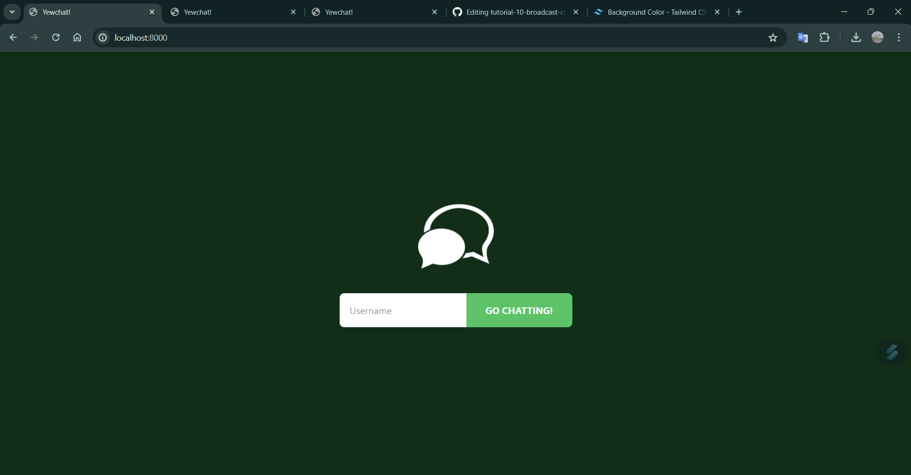
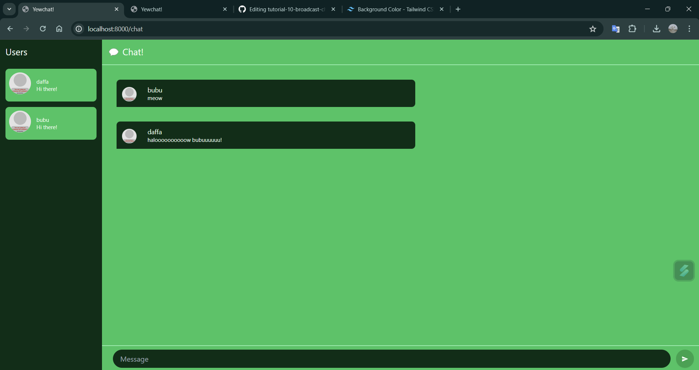

# TUTORIAL 10 ADPRO  (Asynchronous Programming)
#### Daffa Mohamad Fathoni (2206824161)
#### Advanced Programming B / GEN

## REFLECTION
>Experiment 3.1: Original code

>Experiment 3.2: Be Creative!

Pada commit ke 3.2, saya melakukan styling pada htmlnya dengan framework tailwind sesuai dengan code sebelumnya. Saya memilih warna green dark mode agar lebih enak dilihat oleh pengguna.

Selain itu saya juga menambahkan icon di atas form username agar lebih menarik dan pengguna mengetahui bahwa website yang diakses adalah berupa webchat

Saya pun juga mengubah warna pada halaman chat dengan warna palet kehijauan sebagai berikut
